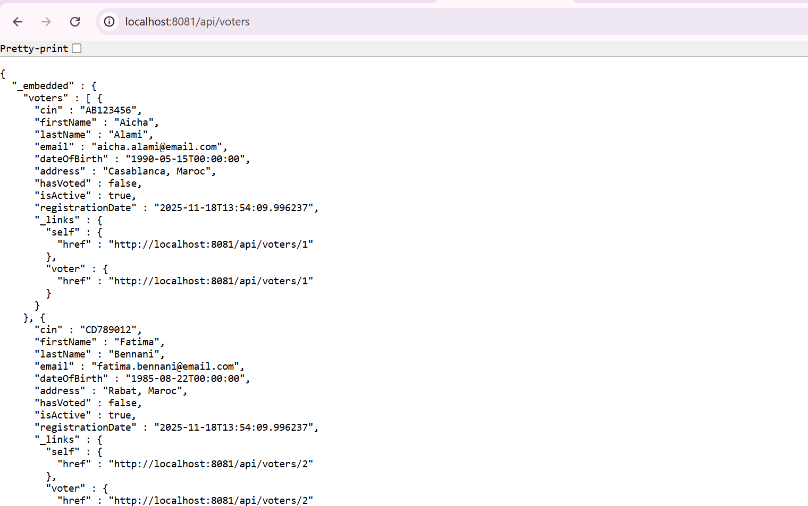
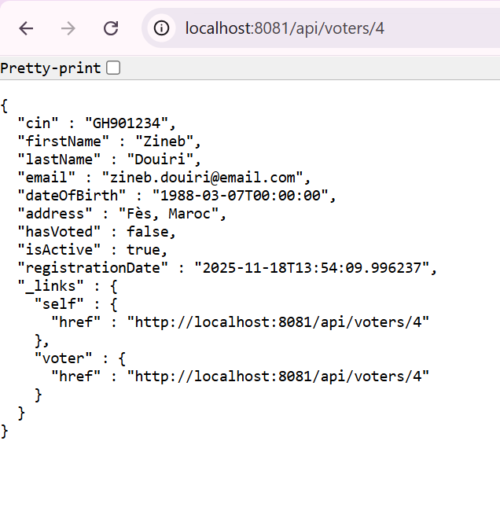
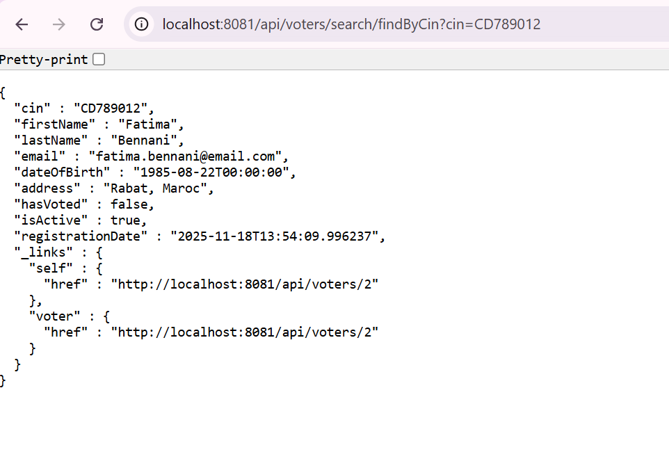
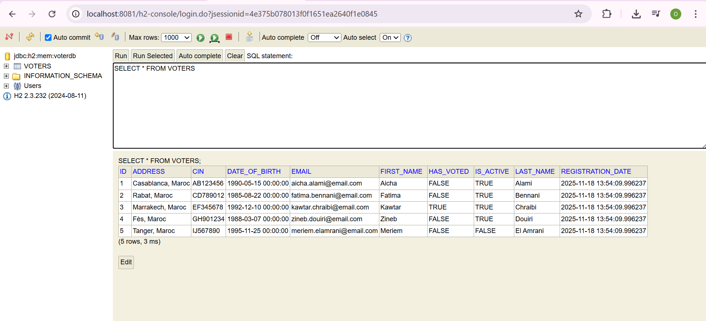

# Backend - Voter Service

## Architecture du Microservice

Ce microservice Spring Boot gère l'enregistrement et la gestion des électeurs avec une API REST automatiquement générée.

---

## 📁 Structure du Projet

```
voter-service/
├── src/main/java/com/voting/voterservice/
│   ├── config/
│   │   └── CorsConfig.java
│   ├── model/
│   │   └── Voter.java
│   ├── repository/
│   │   └── VoterRepository.java
│   └── VoterServiceApplication.java
└── src/main/resources/
    └── application.properties
```

---

## 1️⃣ Configuration CORS - `CorsConfig.java`

### 🎯 Pourquoi CORS ?

Sans cette configuration, le navigateur **bloquerait** les requêtes du frontend (port 3000) vers le backend (port 8081) pour des raisons de sécurité (politique Same-Origin).

### 🔍 Détails de la Configuration

| Élément | Signification |
|---------|---------------|
| `@Configuration` | Indique à Spring que c'est une classe de configuration |
| `WebMvcConfigurer` | Interface pour configurer Spring MVC |
| `addMapping("/**")` | Applique CORS à **tous les endpoints** |
| `allowedOrigins("http://localhost:3000")` | Autorise les requêtes venant du **frontend React** sur le port 3000 |
| `allowedMethods(...)` | Autorise les méthodes HTTP : GET, POST, PUT, DELETE, PATCH |
| `allowedHeaders("*")` | Autorise **tous les headers** HTTP |
| `allowCredentials(true)` | Autorise l'envoi de **cookies** et **credentials** |

---

### 🔍 Annotations Importantes

| Annotation | Rôle |
|------------|------|
| `@Entity` | Indique que c'est une **entité JPA** (table en base de données) |
| `@Data` | **Lombok** : génère automatiquement getters, setters, toString, equals, hashCode |
| `@Table(name = "voters")` | Nom de la table en base de données = "voters" |
| `@Id` | Clé primaire |
| `@GeneratedValue(strategy = IDENTITY)` | L'ID est **auto-incrémenté** par la base de données |
| `@NotBlank` | Validation : le champ **ne peut pas être vide** |
| `@Column(unique = true)` | Le CIN doit être **unique** en base de données |
| `@Column(nullable = false)` | Le champ **ne peut pas être NULL** |
| `@Email` | Validation : doit être un **email valide** |

---
### 🚀 Magie de Spring Data REST

| Élément | Rôle |
|---------|------|
| `@RepositoryRestResource(path = "voters")` | **Magic !** Spring génère automatiquement des endpoints REST à `/api/voters` |
| `extends JpaRepository<Voter, Long>` | Hérite de méthodes CRUD : `save()`, `findAll()`, `findById()`, `delete()` |
| `Optional<Voter> findByCin(String cin)` | Méthode personnalisée : cherche un électeur par CIN |
| `boolean existsByCin(String cin)` | Vérifie si un CIN existe déjà |

### 📡 Endpoints Générés Automatiquement

```http
GET    /api/voters              → Liste tous les électeurs
GET    /api/voters/{id}         → Détails d'un électeur
POST   /api/voters              → Créer un électeur
PUT    /api/voters/{id}         → Modifier un électeur
DELETE /api/voters/{id}         → Supprimer un électeur
GET    /api/voters/search/findByCin?cin={cin} → Recherche par CIN
```

---


### 🔍 Détails de la Configuration

| Propriété | Signification |
|-----------|---------------|
| `server.port=8081` | Le service tourne sur le **port 8081** |
| `spring.datasource.url=jdbc:h2:mem:voterdb` | Base de données **H2 en mémoire** (données perdues au redémarrage) |
| `spring.datasource.username=sa` | Utilisateur par défaut H2 |
| `spring.datasource.password=` | Pas de mot de passe |
| `spring.h2.console.enabled=true` | Active la **console H2** à `http://localhost:8081/h2-console` |
| `spring.jpa.hibernate.ddl-auto=update` | Hibernate crée/met à jour automatiquement les tables |
| `spring.data.rest.base-path=/api` | Tous les endpoints REST commencent par **/api** |

---

## 🧪 Tests des Endpoints

### 1. Liste de tous les électeurs

**Requête :**
```http
GET http://localhost:8081/api/voters
```

**Capture d'écran :**



---

### 2. Détails d'un électeur

**Requête :**
```http
GET http://localhost:8081/api/voters/4
```

**Capture d'écran :**



---

### 3. Recherche par CIN

**Requête :**
```http
GET http://localhost:8081/api/voters/search/findByCin?cin=AB123
```

**Capture d'écran :**



---

### 4. Console H2

**URL :** `http://localhost:8081/h2-console`

**Paramètres de connexion :**
- JDBC URL: `jdbc:h2:mem:voterdb`
- Username: `sa`
- Password: *(laisser vide)*

**Capture d'écran :**



---

## 🎯 Résumé du Fonctionnement

1. **CorsConfig** → Autorise le frontend React à communiquer avec le backend
2. **Voter** → Définit la structure de la table `voters` en base de données
3. **VoterRepository** → Génère automatiquement les endpoints REST
4. **VoterServiceApplication** → Lance l'application
5. **application.properties** → Configure le port, la base H2, et Spring Data REST

---

## 🚀 Démarrage du Service

```bash
# Avec Maven
mvn spring-boot:run

# Avec Gradle
./gradlew bootRun
```

Le service sera accessible à : `http://localhost:8081`

---
